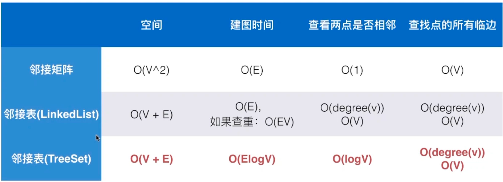

# Graph Basics

*图的分类*

- 顶点 *Vertex*
- 边 *Edge*

- *Direction*
    - 无向图 *Undirected Graph*
    - 有向图 *Directed Graph*
- *Weigh*
    - 无权图
    - 有权图

> 没有自环边，没有平行边 ---> 简单图
>
> 联通分量：一个图中的所有节点不一定是全部相连的
>
> 是否有环 *loop*
>
> 无环图（🌲）
>
> 度 *degree*: 
>
> - 无向图：顶点相邻的边数
> - 有向图：入度，出度

## 图的基本表示

