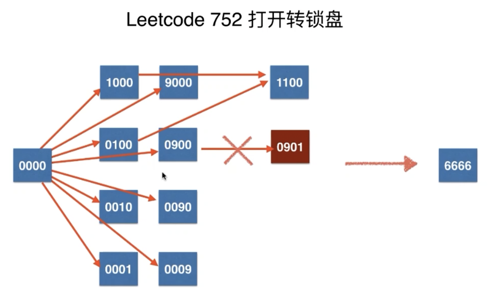
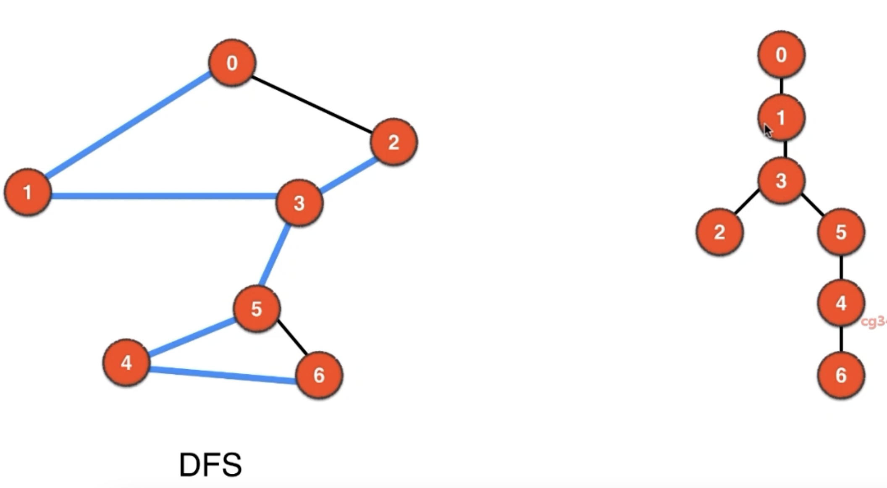
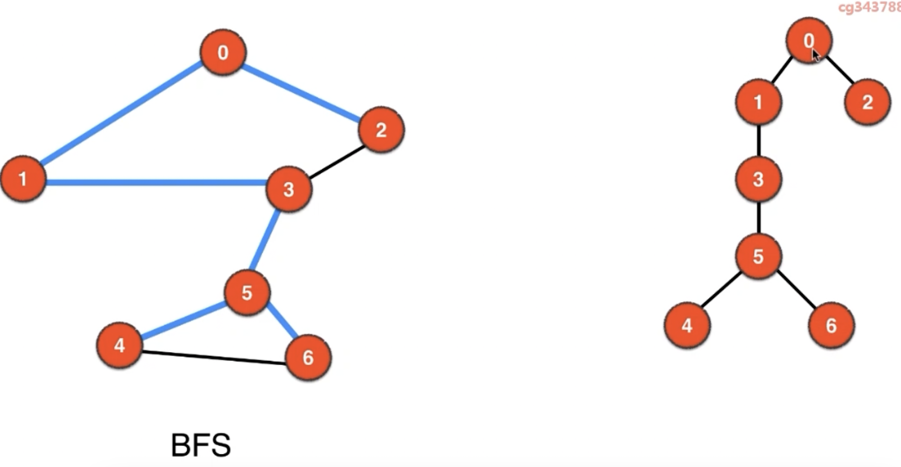
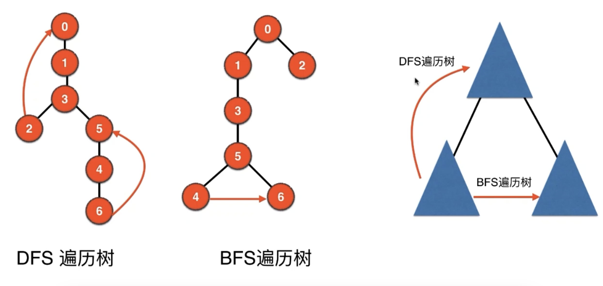
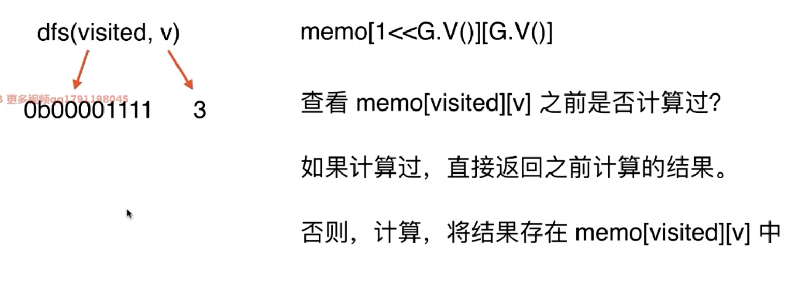
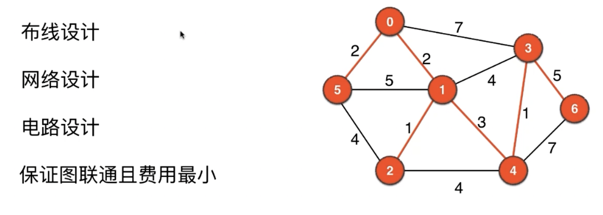
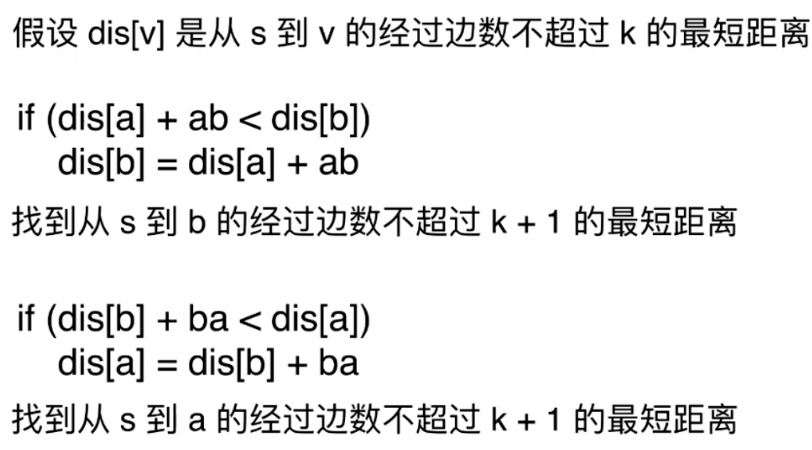

# Graph Basics

*图的分类*

- 顶点 *Vertex*
- 边 *Edge*


- *Direction*
    - 无向图 *Undirected Graph*
    - 有向图 *Directed Graph*
- *Weigh*
    - 无权图
    - 有权图

> 没有自环边，没有平行边 ---> 简单图
>
> 联通分量：一个图中的所有节点不一定是全部相连的
>
> 是否有环 *loop*
>
> 无环图（🌲）
>
> 度 *degree*: 
>
> - 无向图：顶点相邻的边数
> - 有向图：入度，出度

## 图的基本表示


| 实现 | 空间 | 建图 | hasEdge | adj  |
| :-:-: | :-:-: | :--:--: | :--:--: | :-:-: |
| AdjMatrix | O(V^2) | O(E) | O(1) |O(V)|
| AdjList | O(V + E) | O(EV) | O(degree(v)) |O(degree(v))|
| AdjSet | O(V + E) | O(ElogV) | O(degree(v)) |O(degree(v))|


# DFS

复杂度 O(V + E)

对照二叉树的前序 & 后序遍历

有环：使用 visited 数据记录访问情况


# DFS Application

- 无向图的联通分量 *connected component*
    - 记录信息 -- ccid
    - 整张图有几个
    - 每个顶点分别在哪个联通分量

- 路径问题
    - 记录信息 -- pre
    - 单源路径 (非最短)

- 检测无向图的环
- 二分图检测
    - 记录信息 -- color
    - x顶点 V 可以分成不相交的两部分
    - 所有边的两个端点隶属于不同的部分


# BFS

> 利用队列，和树的BFS几乎一样，需要用 visited 数组避免元素重复入队

`O(V + E)`

- 连通图 E
- 非连通图 V

*应用*

- 单源最短路径
    - 使用 `pre` 数组


# floodfill

> 使用 DFS/BFS 解决二维网格的相关问题
> 
> LC : 200 1020 130 733 1034 529 827(hard)

```
// 1. 坐标映射
// 2D ==> 1D
// (x, y) ==> x*Y + y
// 1D ==> 2D
// M ==> (M / Y, M % Y)

// 2.四联通 dirs -- 用于遍历节点
//      八联通 dirs 包含8个方向

// 3.求联通分量CC中顶点的个数 recursive
```


# 图论搜索


无权图最短路径: BFS (LC 1091)

图论建模核心: *状态表达* (LC 752)



 *状态压缩*

>装水问题: 两桶水的状态，不同的位数表示不同的桶的水量

LC 773 表达六位数的状态

- int
- String 


 

# 桥和割点

> 桥：对于无向图，删除一条边，整张图的联通分量数量变化 *Bridge*
>
> 特别的，一颗树的所有边都是桥

*寻桥算法：* DFS + 记录额外信息

判断 `v-w` 是不是桥:

-  通过 w 是否能够回到 v 或者 v **之前**的顶点
- 使用 `ord[v]` 记录 v 在 DFS 的访问顺序
- `low[v]` 表示 DFS 过程中 v 从**另外一条路(不经过parent)**能达到的最小的 ord 值


*BFS & DFS 遍历树*







- DFS - 遍历树的回向边会指向祖先节点
- BFS - 遍历树的回向边不会指向祖先节点


*割点 Cut / Articulation Points*

> 删除顶点后，图的联通分量数量发生变化


- 对于边 `v-w`，满足 `low[w] > ord[v]` ，则 `v-w`是桥
- 如果点 v 有一个孩子节点 w，满足 `low[w] >= ord[v]`，则 v 是割点
    - 特殊情况：根节点
        - 只有当根节点有一个以上的孩子(指<u>遍历树中的孩子，而不是图的邻边</u>)，则根节点是割点


 

# 哈密尔顿&状态压缩

*哈密尔顿回路：*从一个点出发，每个顶点经过一次，回到出发点

> 爱尔兰数学家哈密尔顿提出，正十二面体二十条边，是否存在该回路
>
> 旅行推销员问题 (TSP) 带权图 + 完全图

使用**回溯法**在所有可能的路径中找哈密尔顿回路


*哈密尔顿路径*：不需要通过该路径回到出发点

> 能否找到哈密尔顿路径与起始点相关
>
> LC 980

 *状态压缩*

> 由于图论问题常常需要 np 算法，因此数据规模一般不会很大，可以使用 int (32位) 表示每个顶点的状态

- 检查第 i 位是不是 1 : `visited & (1 << i)`
- 将第 i 位设置为 1 : `visited + (i << i)`
- 将第 i 位设置为 0 : `visited - (i << i)`

*记忆化搜索*

> 解决重复搜索的问题



# 欧拉

*欧拉回路*

> 从一点出发，经过每条边一次，回到原顶点
>
> 由于是回路，对于每个顶点，都需要进去一次，出去一次
>
> 又由于每条边都需要访问一次，因此每个顶点相连的边对于该顶点都会分按照进出配置，因此邻边数一定是偶数

欧拉回路的性质

对于无向联通图，每个点的度数是偶数等价于该图存在欧拉回路


*Fleury算法* : 有多条边的时候，不走桥 (贪心算法)，需要对每个邻边，判断一下桥，**不能预处理**

`O((V + E) ^ 2)`


*Hierholzer算法* : O(V + E) 

- `curPath`: 记录当前路径上的节点
- `loop`: 遍历完环之后将节点压入此栈中


# 最小生成树



算法思想

- 尽量使用短边

    - Kruskal：每次选择最短的边，如果没有形成环，相当于对一个切分选择了最短横切边  

    - 贪心算法

        ```
        切分定理
        切分 : 图中的顶点分为两部分
        横切边 : 一个边的两个端点，属于不同的切分 
        横切边中最短的边，一定属于最小生成树(反证法)
        ```

    -  Prim: 每次找当前切分的最短横切边，不断拓展切分，直到没有切分


# 最短路径

- 路径规划

## Dijkstra

> Single Source Shortest Path for Weighted Graph  
>
> No Minus Weighted Edge

每轮循环

- 找到当前没有访问的最短路节点 -- *优先队列*
- 确认这个节点的最短路就是当前大小
- `O(ElogE)`

## Bellman-Ford

> 处理含**负权边**图的最短路径 - 适用于**有向图**
>
> `O(V * V * E)`

*松弛操作*



重复该过程，求出到所有点经过的边数最多为 **V - 1** 的最短路 (因为没有负权环)

> 存在负权环时，没有最短路径
>
> 对于无向图，有负权边等于有负权环
>
> 负权边检测：第 V 次循环，如果路径还有减少，则说明存在负权环

## Floyed

> 所有**点对**最短路径
>
> 图的直径：所有点对最短路径的最大值
>
> `O(V^3)`


- 初始，如果 v-w 有边 `dis[v][w] = vw; dis[v][v] = 0`

- ```java
    // 每轮循环求解中间经过[0 ... t]这些点的最短路径
    for (int t = 0; t < V; ++t)
    	for (int v = 0; v < V; ++v)
        for (int w = 0; w < V; +=w) 
          if (dis[v][t] + dis[t][w] < dis[v][w])
            dis[v][w] = dis[v][t] + dis[t][w];
    ```

-  存在负权环，那么必存在 `dis[v][v] < 0`


# 有向图算法

 有向无向一致的算法

- DFS
- BFS
- Bellman-Ford, Floyed


## 有向图的环检测

> 遍历过不代表存在环，需要记录在**当前路径**上的顶点
>
> 只有在遍历过程中遇到当前路径上的顶点才代表有环


- 程序模块的调用
- 任务调度
- 学习计划

有向无环图 *DAG*

## 有向图的度

- indegree
- outdegree

 应用：求解有向图的欧拉回路

每个点的入度 == 出度 

 

## 拓扑排序

> Topo Sort
>
> 统计所有的入度为 0 的顶点入队
>
> Only DAG - 可以用于有向图的环检测 (如果拓扑排序无解)

  

## 有向图的强联通分量

> 有向图的强联通分量中，任意两点都互相可达

*将所有强联通分量看作一个点，得到新的有向图一定是DAG*

*Kosaraju*

``` 
将原图边的方向相反，对反图进行后序遍历
证明:
		如果一个强联通分量能到一点，则翻转这张图后，进行后序遍历，这个点一定在强联通分量遍历完后出现
```


 


